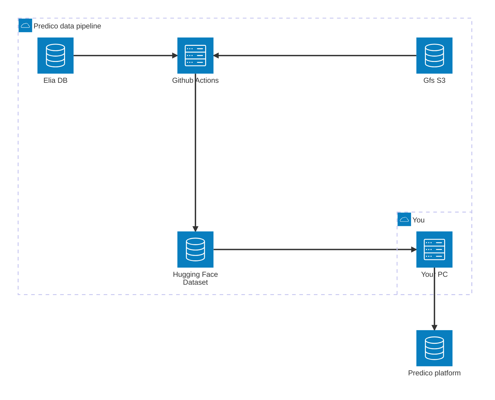

# Predico Data Pipeline
This is a collection of functions and pipelines to download data useful to produce forecast for [Elia Predico platform](https://innovation.eliagroup.eu/en/projects/predico-collaborative-forecasting-platform).

## Data sources:
* **Actual**: [Elia](https://opendata.elia.be/explore/?q=Wind%20power&disjunctive.theme&disjunctive.dcat.granularity&disjunctive.dcat.accrualperiodicity&disjunctive.keyword&sort=explore.popularity_score)
* **Weather forecasts**: [AWS Gfs bucket](https://noaa-gefs-pds.s3.amazonaws.com/index.html)

## Workflow

